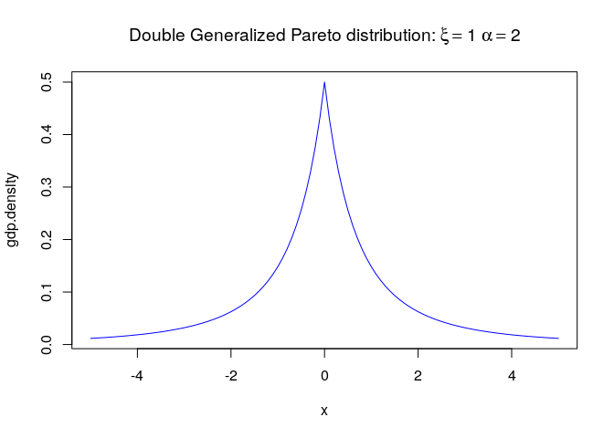

<!-- README.md is generated from README.Rmd. Please edit that file -->
bdist
=====

[](https://cran.r-project.org/package=bdist)

This is a package of distributions I have found useful for Bayesian analysis. Distributions include:

-   double Generalized Pareto
-   Weibull (alternative parameterization)
-   student t (alternative parameterization)
-   truncated normal
-   multivariate normal
-   inverse gamma
-   inverse root gamma

All distributions include density, quantile, cdf, and generation functions, and all are unit tested.

Installation
------------

    library(devtools)
    install_github('kuperov/bdist')

Example
-------

Plot a double generalized Pareto distribution:

``` r
  library(bdist)
  gdp.density <- function(x) dgdp(x, xi = 1, alpha = 2)
  plot(gdp.density, from = -5, to = 5, col = 'blue',
       main = expression("Double Generalized Pareto distribution:" ~
                           xi == 1~alpha == 2))
```


